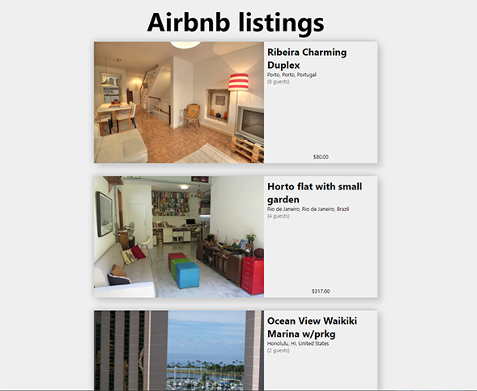

# Next.JS with MongoDB (Atlas)

## Made for reference

Extremely simple Next.js application demonstrating integration with a MongoDB Atlas database. Made for reference, following [walk through](https://youtu.be/MOqkfQIMdLE) from [Vercel](https://vercel.com/)

Using the sample database, provided by MongoDB Atlas, displays airbnb listings via Next.js' built in API router.

<figure>
  
  <figcaption>
    Final Product of Next.js Application
  </figcaption>
</figure>
